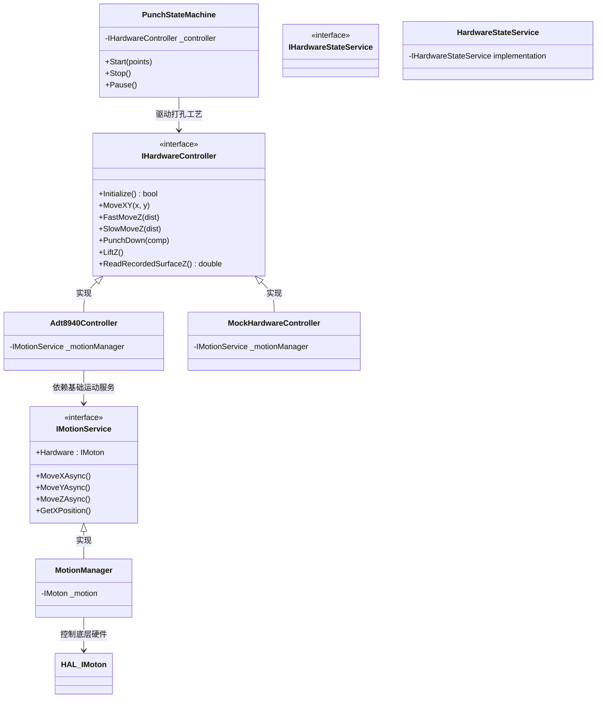
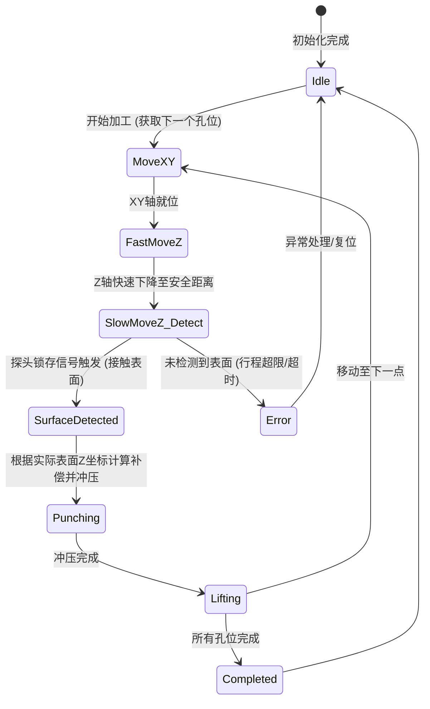

# BLL (业务逻辑层) 架构设计与文档说明

本文档介绍了 `Fredy.Drilling.Holes` 项目中 BLL（Business Logic Layer，业务逻辑层）的整体架构、核心工作流以及各个类的主要职责。BLL 层主要负责将纯碎的硬件运动（HAL层）进一步抽象并组合成具有具体工艺意义的业务动作（如：对位、探查表面和冲压加工）。

## 1. 架构关系图 (Architecture)

BLL 层通过接口反转依赖（Dependency Inversion）实现了纯功能运动逻辑与工艺逻辑的解耦。

## 2. 核心打孔工作流程图 (Process Flow)

打孔状态机 (`PunchStateMachine`) 控制着每一个孔位的加工生命周期。加工单个孔位的基本流程如下：

## 3. 各个目录与类的职责说明

### BLL 层根目录
*   **`AutoPunchMachine.cs` (`PunchStateMachine`)**
    *   **职责**: 核心打孔状态机。它本身不关心底层板卡型号或具体运动脉冲，只负责**业务工序调度**。它实现了“平移 -> 快降 -> 慢探 -> 冲压 -> 抬起”的完整生命周期管理。
*   **`IMotionService.cs` & `MotionManager.cs`**
    *   **职责**: 通用三轴（X、Y、Z）运动控制服务。负责基础物理运动的封装，如：绝对定位、相对步进、回零、速度及加速度应用等。现在它内部保留了对基础运动接口（纯运动属性）的管理，并向外暴露 `Hardware` 用于需要特殊硬件功能时的操作。
*   **`IHardwareStateService.cs` & `HardwareStateService.cs`**
    *   **职责**: 硬件状态（IO、报警、伺服状态运行位等）的监控服务。在后台刷新坐标和 GPIO 信息，供 UI 或业务层订阅，避免了在 ViewModel 中的直接轮询。
*   **`SecondPassAlignmentContext.cs`**
    *   **职责**: 二次对位/加工上下文，管理和缓存视觉对准以及多次处理工序中所需的偏移转换数据。

### `Hardware` 目录 (业务硬件控制器)
通过抽象 `IHardwareController` 隔离真实动作库：
*   **`IHardwareController.cs`**
    *   **职责**: 业务视角的硬件接口。内部只涉及和业务打孔相关的宏观指令，例如 `MoveXY`（平移到孔位）、`FastMoveZ`（快降）、`SlowMoveZ`（带锁存探测的慢探）等。
*   **`Adt8940Controller.cs`**
    *   **职责**: 基于 `众为兴 ADT8940A1` 控制卡的真实业务控制器实现。它依赖 `IMotionService` 来完成运动控制，而特殊功能（如 Z轴触碰物料时的硬件位置锁存 `ReadRecordedSurfaceZ`）则通过转换 `_motionManager.Hardware` 来精确下发 SDK 专有指令。
*   **`MockHardwareController.cs`**
    *   **职责**: 模拟控制器实现。不依赖真实硬件，通过 Thread.Sleep 模拟运动延迟并返回伪造的触碰坐标，主要用于上层 UI 测试和脱机离线开发。

### `Enums` 目录 (状态枚举)
*   **`PunchEnums.cs`**
    *   **职责**: 定义了加工过程中的所有机器和孔位的工作状态枚举（例如状态机所在的 `Idle`, `Moving`, `Punching`, `Error` 等）。

### `Events` 目录 (事件模型)
*   **`PunchEventArgs.cs`**
    *   **职责**: 封装了 BLL 层触发核心状态与流转通知时所携带的参数信息（如进度百分比、当前针位坐标等），供外围监听和响应。

## 4. 设计原则总结
1.  **单一职责 (SRP)**: `MotionManager` 只负责把轴移动到指定位置，不管怎么“探”或“冲”。`PunchStateMachine` 只关心工艺步骤，不管具体向右转几圈。
2.  **依赖倒置 (DIP)**: `Adt8940Controller` 依赖于在项目启动时注入的通用 `IMotionService` 接口，解耦了对 HAL 驱动器的重复实例注册。
3.  **响应式通信 (Reactive)**: 通过 `HardwareStateService` 与 `PunchEventArgs` 完成基于事件的状态上抛与后台监测，UI 依据推送呈现最新数据。