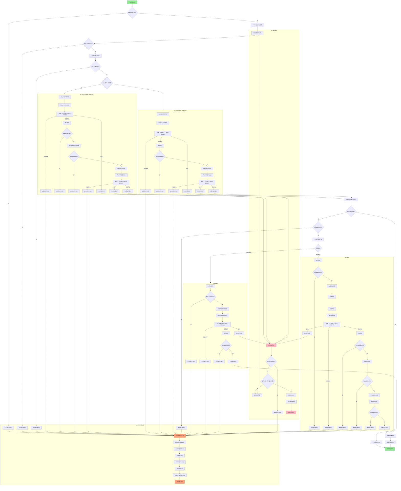

```mermaid
graph TD
    START[开始回零流程] --> CHECK_STOP1{检查紧急停止标志}
    CHECK_STOP1 -- 是 --> EMERGENCY_STOP1[紧急停止并退出]
    CHECK_STOP1 -- 否 --> INIT[记录日志/初始化参数]
    
    INIT --> MECH_LOOP_START[机械回零循环开始]
    
    MECH_LOOP_START --> CHECK_STOP2{检查紧急停止标志}
    CHECK_STOP2 -- 是 --> EMERGENCY_STOP2[紧急停止并退出]
    CHECK_STOP2 -- 否 --> READ_SWITCH[读取机械开关电平]
    
    READ_SWITCH --> CHECK_STOP3{检查紧急停止标志}
    CHECK_STOP3 -- 是 --> EMERGENCY_STOP3[紧急停止并退出]
    CHECK_STOP3 -- 否 --> LEVEL_CHECK{开关电平 = 设定值?}
    
    LEVEL_CHECK -- 是 --> LEFT_BRANCH
    LEVEL_CHECK -- 否 --> RIGHT_BRANCH
    
    subgraph LEFT_BRANCH [开关电平=设定值（向左运动）]
        LEFT_MOVE[向负方向连续运动] --> LEFT_DETECT[检测开关信号变为0]
        LEFT_DETECT --> LEFT_CHECK_TIMEOUT[检查: 1.紧急停止 2.超时 3.信号变化]
        LEFT_CHECK_TIMEOUT -- 紧急停止 --> EMERGENCY_LEFT1[紧急停止并退出]
        LEFT_CHECK_TIMEOUT -- 超时 --> ERROR_LEFT1[进入错误处理]
        LEFT_CHECK_TIMEOUT -- 信号变化 --> LEFT_STOP[停止电机]
        LEFT_STOP --> LEFT_STOP_CHECK{检查紧急停止标志}
        LEFT_STOP_CHECK -- 是 --> EMERGENCY_LEFT2[紧急停止并退出]
        LEFT_STOP_CHECK -- 否 --> LEFT_RETRACT[向正方向移动200脉冲]
        LEFT_RETRACT --> LEFT_RETRACT_CHECK{检查紧急停止标志}
        LEFT_RETRACT_CHECK -- 是 --> EMERGENCY_LEFT3[紧急停止并退出]
        LEFT_RETRACT_CHECK -- 否 --> LEFT_SLOW[慢速向负方向运动]
        LEFT_SLOW --> LEFT_DETECT2[检测开关信号变为0]
        LEFT_DETECT2 --> LEFT_CHECK_TIMEOUT2[检查: 1.紧急停止 2.超时 3.信号变化]
        LEFT_CHECK_TIMEOUT2 -- 紧急停止 --> EMERGENCY_LEFT4[紧急停止并退出]
        LEFT_CHECK_TIMEOUT2 -- 超时 --> ERROR_LEFT2[进入错误处理]
        LEFT_CHECK_TIMEOUT2 -- 信号变化 --> LEFT_SET_ZERO[设置X轴位置=0]
    end
    
    subgraph RIGHT_BRANCH [开关电平≠设定值（向右运动）]
        RIGHT_MOVE[向正方向连续运动] --> RIGHT_DETECT[检测开关信号变为1]
        RIGHT_DETECT --> RIGHT_CHECK_TIMEOUT[检查: 1.紧急停止 2.超时 3.信号变化]
        RIGHT_CHECK_TIMEOUT -- 紧急停止 --> EMERGENCY_RIGHT1[紧急停止并退出]
        RIGHT_CHECK_TIMEOUT -- 超时 --> ERROR_RIGHT1[进入错误处理]
        RIGHT_CHECK_TIMEOUT -- 信号变化 --> RIGHT_STOP[停止电机]
        RIGHT_STOP --> RIGHT_STOP_CHECK{检查紧急停止标志}
        RIGHT_STOP_CHECK -- 是 --> EMERGENCY_RIGHT2[紧急停止并退出]
        RIGHT_STOP_CHECK -- 否 --> RIGHT_SLOW[慢速向负方向运动]
        RIGHT_SLOW --> RIGHT_DETECT2[检测开关信号变为0]
        RIGHT_DETECT2 --> RIGHT_CHECK_TIMEOUT2[检查: 1.紧急停止 2.超时 3.信号变化]
        RIGHT_CHECK_TIMEOUT2 -- 紧急停止 --> EMERGENCY_RIGHT3[紧急停止并退出]
        RIGHT_CHECK_TIMEOUT2 -- 超时 --> ERROR_RIGHT2[进入错误处理]
        RIGHT_CHECK_TIMEOUT2 -- 信号变化 --> RIGHT_SET_ZERO[设置X轴位置=0]
    end
    
    LEFT_SET_ZERO --> MECH_SET_FLAG[设置机械回零完成标志]
    RIGHT_SET_ZERO --> MECH_SET_FLAG
    
    MECH_SET_FLAG --> ENCODER_CHECK{启用光栅尺回零?}
    
    ENCODER_CHECK -- 是 --> ENCODER_CHECK_STOP{检查紧急停止标志}
    ENCODER_CHECK_STOP -- 是 --> EMERGENCY_ENCODER1[紧急停止并退出]
    ENCODER_CHECK_STOP -- 否 --> ENCODER_HOME_START[光栅尺回零开始]
    
    ENCODER_CHECK -- 否 --> SET_FLAG_NO[设置回零标志=1]
    SET_FLAG_NO --> END_SUCCESS[回零成功结束]
    
    ENCODER_HOME_START --> MODE_CHECK{回零模式?}
    
    MODE_CHECK -- IO检测模式 --> IO_MODE
    MODE_CHECK -- 锁存模式 --> LATCH_MODE
    
    subgraph IO_MODE [IO检测模式]
        IO_START[IO检测模式] --> IO_CHECK_STOP{检查紧急停止标志}
        IO_CHECK_STOP -- 是 --> EMERGENCY_IO1[紧急停止并退出]
        IO_CHECK_STOP -- 否 --> IO_MOVE[启动运动并检测信号]
        IO_MOVE --> IO_DETECT[检测光栅零位信号=0]
        IO_DETECT --> IO_CHECK_TIMEOUT[检查: 1.紧急停止 2.超时 3.信号变化]
        IO_CHECK_TIMEOUT -- 紧急停止 --> EMERGENCY_IO2[紧急停止并退出]
        IO_CHECK_TIMEOUT -- 超时 --> ERROR_IO[进入错误处理]
        IO_CHECK_TIMEOUT -- 信号变化 --> IO_STOP[停止电机]
        IO_STOP --> IO_STOP_CHECK{检查紧急停止标志}
        IO_STOP_CHECK -- 是 --> EMERGENCY_IO3[紧急停止并退出]
        IO_STOP_CHECK -- 否 --> IO_SET_ZERO[设置X轴位置=0]
    end
    
    subgraph LATCH_MODE [锁存模式]
        LATCH_START[锁存模式] --> LATCH_CHECK_STOP{检查紧急停止标志}
        LATCH_CHECK_STOP -- 是 --> EMERGENCY_LATCH1[紧急停止并退出]
        LATCH_CHECK_STOP -- 否 --> LATCH_CONFIG[配置锁存参数]
        LATCH_CONFIG --> LATCH_ENABLE[启用锁存]
        LATCH_ENABLE --> LATCH_MOVE[启动运动]
        LATCH_MOVE --> LATCH_WAIT[等待锁存完成]
        LATCH_WAIT --> LATCH_CHECK_TIMEOUT[检查: 1.紧急停止 2.超时 3.锁存完成]
        LATCH_CHECK_TIMEOUT -- 紧急停止 --> EMERGENCY_LATCH2[紧急停止并退出]
        LATCH_CHECK_TIMEOUT -- 超时 --> ERROR_LATCH[进入错误处理]
        LATCH_CHECK_TIMEOUT -- 锁存完成 --> LATCH_STOP[停止电机]
        LATCH_STOP --> LATCH_STOP_CHECK{检查紧急停止标志}
        LATCH_STOP_CHECK -- 是 --> EMERGENCY_LATCH3[紧急停止并退出]
        LATCH_STOP_CHECK -- 否 --> READ_LATCH[读取锁存位置]
        READ_LATCH --> LATCH_MOVE_CHECK{检查紧急停止标志}
        LATCH_MOVE_CHECK -- 是 --> EMERGENCY_LATCH4[紧急停止并退出]
        LATCH_MOVE_CHECK -- 否 --> MOVE_TO_LATCH[移动到锁存位置]
        MOVE_TO_LATCH --> LATCH_MOVE_WAIT[等待移动完成]
        LATCH_MOVE_WAIT --> LATCH_MOVE_CHECK2{检查紧急停止标志}
        LATCH_MOVE_CHECK2 -- 是 --> EMERGENCY_LATCH5[紧急停止并退出]
        LATCH_MOVE_CHECK2 -- 否 --> LATCH_SET_ZERO[设置X轴位置=0]
    end
    
    IO_SET_ZERO --> ENCODER_COMPLETE[光栅尺回零完成]
    LATCH_SET_ZERO --> ENCODER_COMPLETE
    
    ENCODER_COMPLETE --> SET_FLAG_YES[设置回零标志=1]
    SET_FLAG_YES --> END_SUCCESS
    
    subgraph ERROR_HANDLING [错误处理模块]
        ERROR_LEFT1 --> ERROR_ENTRY
        ERROR_LEFT2 --> ERROR_ENTRY
        ERROR_RIGHT1 --> ERROR_ENTRY
        ERROR_RIGHT2 --> ERROR_ENTRY
        ERROR_IO --> ERROR_ENTRY
        ERROR_LATCH --> ERROR_ENTRY
        
        ERROR_ENTRY[错误处理入口] --> ERROR_CHECK_STOP{检查紧急停止标志}
        ERROR_CHECK_STOP -- 是 --> EMERGENCY_ERROR[紧急停止并退出]
        ERROR_CHECK_STOP -- 否 --> RETRY_CHECK{重试次数 < 最大重试次数?}
        RETRY_CHECK -- 是 --> RETRY_MECH[重试机械回零]
        RETRY_MECH --> MECH_LOOP_START
        
        RETRY_CHECK -- 否 --> LOG_ERROR[记录错误日志]
        LOG_ERROR --> SAFE_STOP[安全停止所有轴]
        SAFE_STOP --> ERROR_END[回零失败结束]
    end
    
    subgraph EMERGENCY_STOP_PROCESS [紧急停止处理流程]
        EMERGENCY_STOP1 --> EMERGENCY_COMMON
        EMERGENCY_STOP2 --> EMERGENCY_COMMON
        EMERGENCY_STOP3 --> EMERGENCY_COMMON
        EMERGENCY_LEFT1 --> EMERGENCY_COMMON
        EMERGENCY_LEFT2 --> EMERGENCY_COMMON
        EMERGENCY_LEFT3 --> EMERGENCY_COMMON
        EMERGENCY_LEFT4 --> EMERGENCY_COMMON
        EMERGENCY_RIGHT1 --> EMERGENCY_COMMON
        EMERGENCY_RIGHT2 --> EMERGENCY_COMMON
        EMERGENCY_RIGHT3 --> EMERGENCY_COMMON
        EMERGENCY_ENCODER1 --> EMERGENCY_COMMON
        EMERGENCY_IO1 --> EMERGENCY_COMMON
        EMERGENCY_IO2 --> EMERGENCY_COMMON
        EMERGENCY_IO3 --> EMERGENCY_COMMON
        EMERGENCY_LATCH1 --> EMERGENCY_COMMON
        EMERGENCY_LATCH2 --> EMERGENCY_COMMON
        EMERGENCY_LATCH3 --> EMERGENCY_COMMON
        EMERGENCY_LATCH4 --> EMERGENCY_COMMON
        EMERGENCY_LATCH5 --> EMERGENCY_COMMON
        EMERGENCY_ERROR --> EMERGENCY_COMMON
        
        EMERGENCY_COMMON[紧急停止统一处理] --> EMERGENCY_IMMEDIATE_STOP[立即停止所有轴运动]
        EMERGENCY_IMMEDIATE_STOP --> RESET_FLAGS[复位所有回零标志]
        RESET_FLAGS --> DISABLE_LATCH[禁用锁存功能]
        DISABLE_LATCH --> LOG_EMERGENCY[记录紧急停止日志]
        LOG_EMERGENCY --> SAVE_POSITION[保存当前位置]
        SAVE_POSITION --> NOTIFY_USER[通知用户紧急停止完成]
        NOTIFY_USER --> EMERGENCY_EXIT[紧急停止退出]
    end
    
    style START fill:#90EE90
    style END_SUCCESS fill:#90EE90
    style ERROR_END fill:#FFB6C1
    style ERROR_ENTRY fill:#FFB6C1
    style EMERGENCY_EXIT fill:#FFA07A
    style EMERGENCY_COMMON fill:#FFA07A
```

