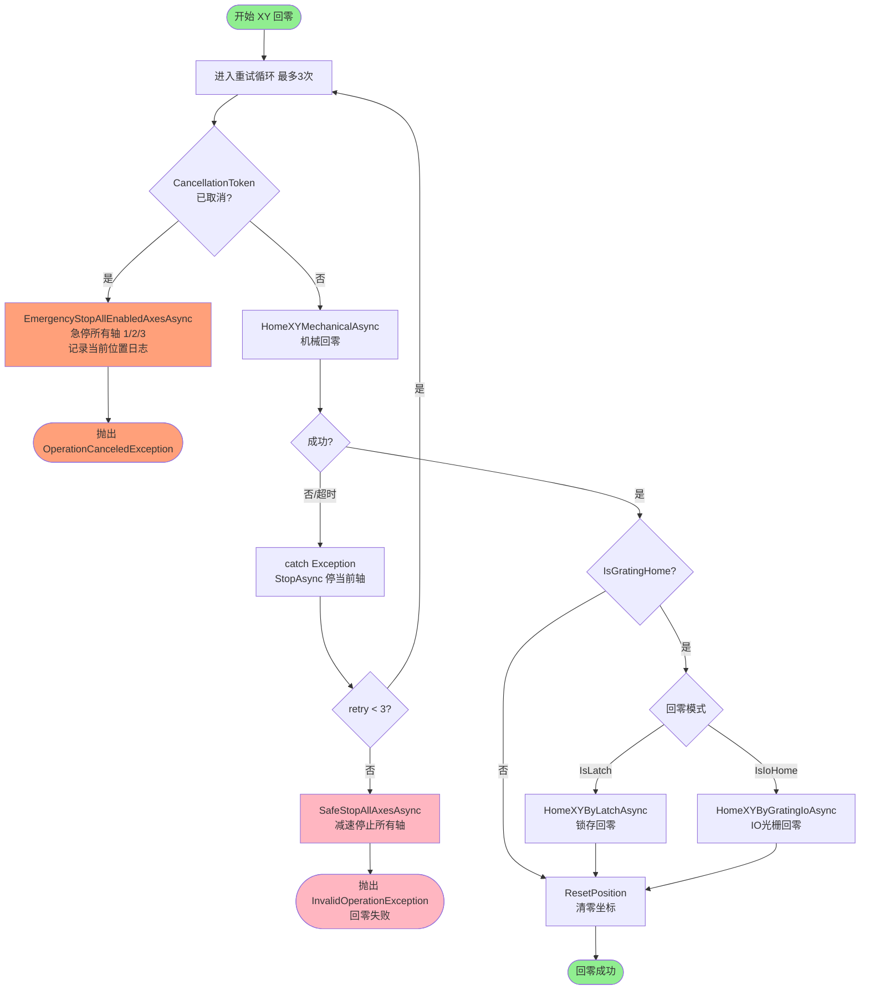
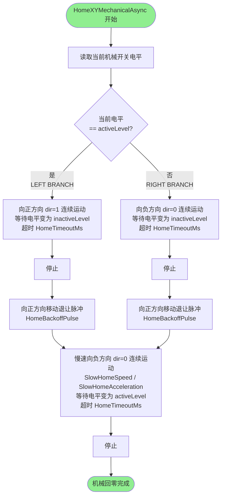
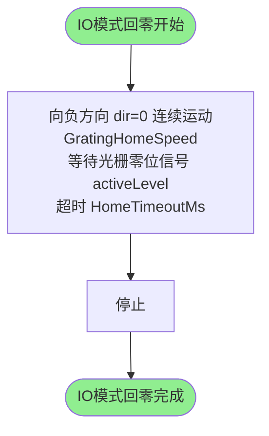
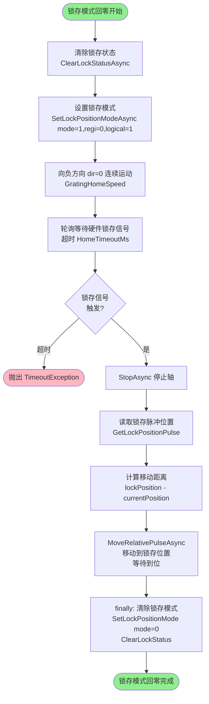
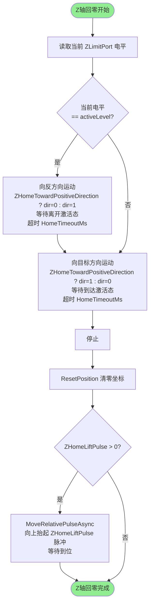
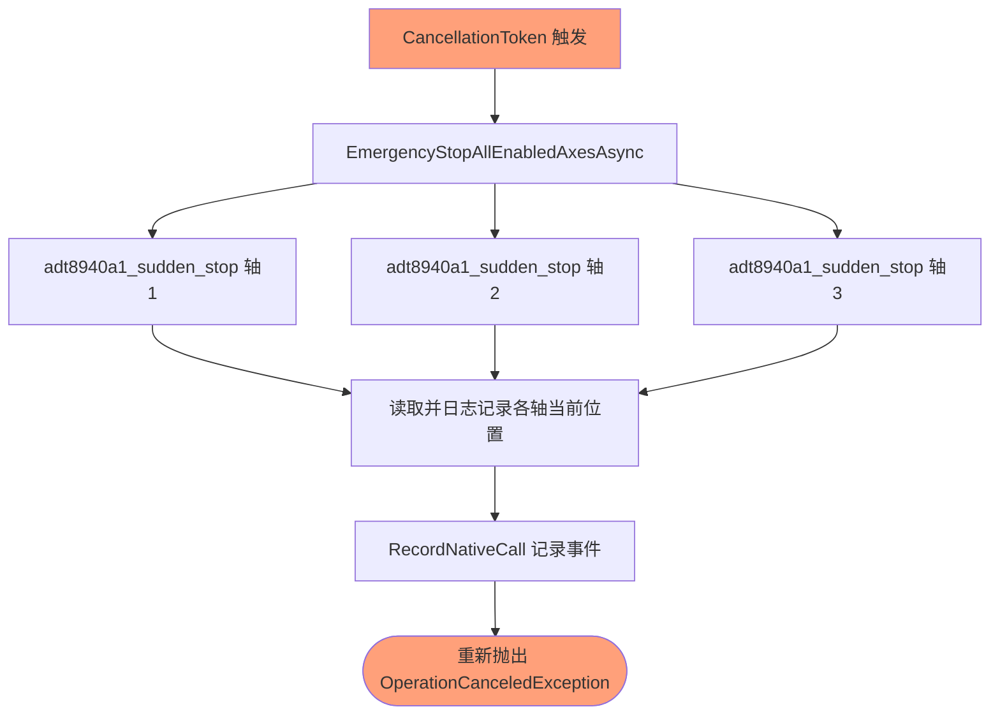

# 回零流程说明（当前实现）

> 对应源文件：`HAL/Motion/MotionAdt8940.cs`  
> 更新时间：2025-07  
> 执行方式：全异步（`async/await + CancellationToken`），取消即触发急停所有轴

---

## 一、总入口

```
HomeAsync(axisNo, wait, cancellationToken)
        │
        ├─ axisNo == 3 ──→ HomeZAxisAsync
        └─ axisNo == 1/2 → HomeXYAxisAsync
```

---

## 二、XY 轴回零总流程



---

## 三、机械回零详细流程（HomeXYMechanicalAsync）

> 传感器激活电平由 `HomingPort.IsLowLevelActive` 决定：  
> - `IsLowLevelActive = true` → `activeLevel = 0`  
> - `IsLowLevelActive = false` → `activeLevel = 1`



**关键参数说明：**

| 参数 | 说明 | 默认值 |
|------|------|--------|
| `HomeSearchSpeed` | 粗找零速度（脉冲/s） | 3000 |
| `HomeBackoffPulse` | 离开传感器后的退让脉冲数 | 200 |
| `SlowHomeStartSpeed` | 慢速起始速度 | 100 |
| `SlowHomeSpeed` | 慢速运行速度 | 500 |
| `SlowHomeAcceleration` | 慢速加速度 | 1000 |
| `HomeTimeoutMs` | 单步超时（ms） | 10000 |

---

## 四、光栅尺 IO 模式回零（HomeXYByGratingIoAsync）



**关键参数：**

| 参数 | 说明 | 默认值 |
|------|------|--------|
| `GratingHomeStartSpeed` | 光栅找零起始速度 | 500 |
| `GratingHomeSpeed` | 光栅找零速度 | 2000 |
| `GratingHomeAcceleration` | 光栅找零加速度 | 2000 |
| `XGratingPort / YGratingPort` | 光栅零位 IO 端口 | — |

---

## 五、锁存模式回零（HomeXYByLatchAsync）



---

## 六、Z 轴回零流程（HomeZAxisAsync）



**关键参数：**

| 参数 | 说明 |
|------|------|
| `ZLimitPort` | Z轴机械零位 IO 端口及有效电平 |
| `ZHomeTowardPositiveDirection` | 回零向正方向运动（true）或负方向（false） |
| `ZHomeLiftPulse` | 回零完成后抬起脉冲数（0=不抬起） |
| `HomeSearchSpeed` | Z轴找零速度 |

---

## 七、紧急停止处理



---

## 八、HomingOptions 配置参数总览

| 参数 | 类型 | 说明 |
|------|------|------|
| `HomeSearchSpeed` | int | 粗找零速度（脉冲/s） |
| `IsIoHome` | bool | 启用 IO 光栅回零 |
| `IsLatch` | bool | 启用硬件锁存回零 |
| `IsGratingHome` | bool | 启用光栅尺回零（总开关） |
| `XLimitPort` | HomingPort | X轴机械零位端口+有效电平 |
| `YLimitPort` | HomingPort | Y轴机械零位端口+有效电平 |
| `ZLimitPort` | HomingPort | Z轴机械零位端口+有效电平 |
| `XGratingPort` | HomingPort | X轴光栅零位端口+有效电平 |
| `YGratingPort` | HomingPort | Y轴光栅零位端口+有效电平 |
| `HomeTimeoutMs` | int | 单步等待超时（ms），默认 10000 |
| `HomeBackoffPulse` | int | 退让脉冲数，默认 200 |
| `ZHomeLiftPulse` | int | Z轴回零后抬起脉冲数，默认 0 |
| `ZHomeTowardPositiveDirection` | bool | Z轴回零方向，默认 false（负方向） |
| `SlowHomeStartSpeed` | int | 慢速起始速度，默认 100 |
| `SlowHomeSpeed` | int | 慢速运行速度，默认 500 |
| `SlowHomeAcceleration` | int | 慢速加速度，默认 1000 |
| `GratingHomeStartSpeed` | int | 光栅找零起始速度，默认 500 |
| `GratingHomeSpeed` | int | 光栅找零速度，默认 2000 |
| `GratingHomeAcceleration` | int | 光栅找零加速度，默认 2000 |
