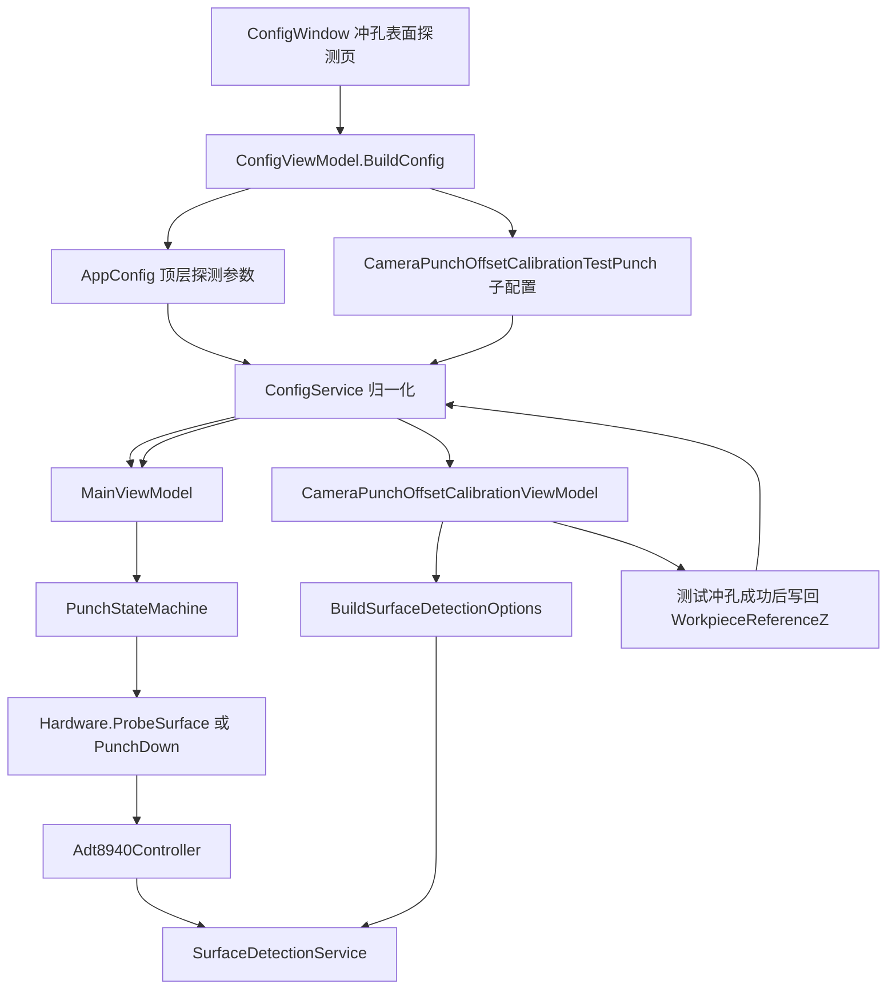
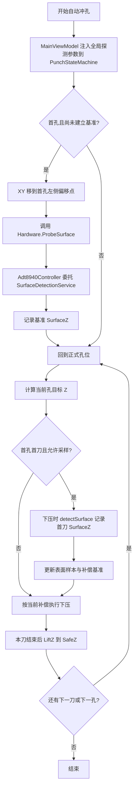
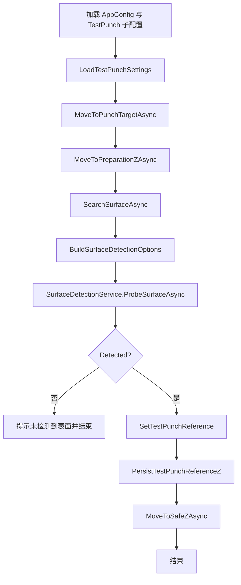
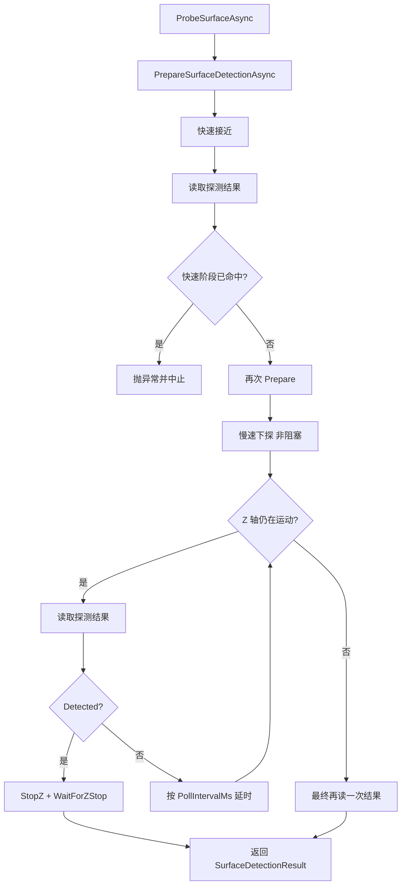

# SurfaceDetectionService 设计说明

## 1. 背景

在自动冲孔流程与相机冲孔偏移校准页中，都存在“沿 Z 轴向下寻找工件表面”的需求。

在统一之前，这两处逻辑存在以下问题：

- 自动冲孔硬件层有一套锁存/IO 探测实现。
- 校准页测试冲孔主要使用 IO 逐步慢探实现。
- 两处对“何时停止 Z”“如何读取 SurfaceZ”“如何处理锁存与 IO 模式”的语义不完全一致。
- 后续若继续分别修改，容易造成工艺行为漂移。

因此新增公共类 `SurfaceDetectionService`，将表面探测行为统一收敛到一处维护。

文件位置：

- `BLL/Hardware/SurfaceDetectionService.cs`

## 2. 设计目标

`SurfaceDetectionService` 的目标不是替代整个硬件控制器，而是只负责“表面探测”这一个明确能力。

它需要解决的事情包括：

1. 统一支持两种探测方式：
   - `Latch`
   - `IoPolling`
2. 提供同步与异步两套入口，方便：
   - BLL 状态机/硬件层同步调用
   - ViewModel/页面异步调用
3. 统一预探流程：
   - 探测前准备
   - 快速接近
   - 提前触发检查
   - 慢速探测
   - 检测到后停止 Z
   - 返回 `SurfaceZ`
4. 把和探测直接相关的底层细节封装起来：
   - 锁存清状态
   - 设置锁存模式
   - 读取锁存状态与锁存坐标
   - 轮询 IO 输入
   - 判断 Z 轴是否仍在运动
   - 停止 Z 轴

## 3. 类职责边界

### 3.1 `SurfaceDetectionService` 负责什么

它负责：

- 执行标准化的探面流程
- 根据 `SurfaceDetectionOptions` 选择 `Latch` 或 `IoPolling`
- 读取并返回探测结果 `SurfaceDetectionResult`
- 在探面命中后停止 Z 轴
- 提供探测相关的公共小能力，例如：
  - `PrepareSurfaceDetectionAsync`
  - `ReadSurfaceDetectionAsync`
  - `IsZAxisMovingAsync`
  - `WaitForZStopAsync`
  - `StopZAsync`

### 3.2 它不负责什么

它不负责：

- 自动冲孔整体状态机推进
- XY 移动规划
- 冲孔终点 Z 计算
- 每刀冲孔后的回安全位
- 正式冲孔动作本身
- UI 提示与对话框

这些仍分别属于：

- `PunchStateMachine`
- `Adt8940Controller`
- `CameraPunchOffsetCalibrationViewModel`

## 4. 依赖关系

`SurfaceDetectionService` 构造时依赖：

- `IMotionService`
- `IIOCard`

原因：

- `IMotionService` 提供 Z 轴位置、运动命令、轴状态、底层运动硬件访问。
- `IIOCard` 在 `IoPolling` 模式下用于读取探测输入。

在 `Latch` 模式下，它还会通过 `IMotionService.Hardware` 向下转换到：

- `HAL.MotionAdt8940`

如果当前运动控制器不是 `MotionAdt8940`，则锁存模式会抛出异常，提示改用 `IoPolling` 或切换控制器。

## 5. 核心数据结构

### 5.1 `SurfaceDetectionOptions`

作用：描述一次探测采用的模式和输入参数。

字段：

- `Mode`
- `InputPort`
- `InputLowActive`
- `PollIntervalMs`

说明：

- `Latch` 模式主要使用 `Mode` 与 `PollIntervalMs`。
- `IoPolling` 模式会使用 `InputPort`、`InputLowActive`、`PollIntervalMs`。

### 5.2 `SurfaceDetectionResult`

作用：表示探测结果。

字段：

- `Detected`
- `SurfaceZ`

语义：

- `Detected=false` 表示未检测到表面。
- `Detected=true` 且 `SurfaceZ` 有效，表示已得到接触位置对应的 Z。

## 6. 核心流程

### 6.1 `ProbeSurfaceAsync(...)`

这是公共探面的主入口。

流程如下：

1. 校验 `options` 不能为空。
2. 调用 `PrepareSurfaceDetectionAsync(options)`。
3. 先执行一次快速接近：
   - `MoveZRelativeAsync(fastDistance, ResolveFastSpeed(fastSpeed), wait: true)`
4. 快速接近完成后立刻读一次探测结果：
   - 如果已经命中，说明针尖高度或工件状态异常，直接抛异常。
5. 再次调用 `PrepareSurfaceDetectionAsync(options)`。
6. 执行慢速探测：
   - `MoveZRelativeAsync(slowDistance, ResolveSlowSpeed(slowSpeed), wait: false)`
7. 在 Z 轴运动过程中循环：
   - 读取探测结果
   - 若命中，立即：
     - `StopZAsync()`
     - `WaitForZStopAsync()`
     - 返回结果
   - 若未命中，按 `PollIntervalMs` 延时继续轮询
8. 若运动结束仍未命中，再读一次最终结果并返回。

### 6.2 为什么要在快速接近后检查一次

这是为了识别“提前触发”的异常情况。

如果在快速接近阶段就已经命中探测信号，通常说明：

- 针尖初始高度不对
- 工件有异物或位置异常
- 锁存状态未正确清理
- IO 已经处于触发态

这种情况下继续慢探会使结果失去工艺意义，所以直接抛出异常更安全。

## 7. 两种探测模式的实现差异

### 7.1 `Latch` 模式

入口准备：

- `ClearLockStatusAsync`
- `SetLockPositionModeAsync(axisZ, 1, 1, 1)`

探测读取：

- `GetLockStatusAsync`
- `GetLockPositionAsync`

优点：

- 通常能拿到更接近触发瞬间的锁存位置
- 不依赖软件轮询时序

限制：

- 当前运动控制器必须是 `MotionAdt8940`
- 依赖底层锁存能力和信号极性配置正确

### 7.2 `IoPolling` 模式

探测读取：

- `ReadInputAsync(options.InputPort)`
- 依据 `InputLowActive` 计算有效态
- 命中时读取当前 `Z` 作为 `SurfaceZ`

优点：

- 通用性强
- 不依赖锁存硬件能力

限制：

- `SurfaceZ` 是软件轮询瞬间读取的当前轴位
- 精度受轮询间隔、系统调度和运动速度影响

## 8. 当前调用方

### 8.1 `Adt8940Controller`

位置：

- `BLL/Hardware/Adt8940Controller.cs`

使用方式：

- `ProbeSurface(...)` 直接调用 `SurfaceDetectionService.ProbeSurface(...)`
- 正式冲孔过程中探测 `SurfaceZ` 时，复用：
  - `PrepareSurfaceDetection`
  - `TryReadSurfaceDetection`
  - `IsZAxisMoving`
  - `ResolvePollInterval`

目的：

- 让“预探”和“正式冲孔中的探测读取”使用相同的模式语义

### 8.2 `CameraPunchOffsetCalibrationViewModel`

位置：

- `Fredy/Windows/CameraPunchOffsetCalibration/CameraPunchOffsetCalibrationViewModel.cs`

使用方式：

- 测试冲孔探面改为直接调用 `SurfaceDetectionService.ProbeSurfaceAsync(...)`
- 页面已支持选择：
  - `Latch`
  - `IoPolling`

目的：

- 校准页和自动冲孔使用同一套探面逻辑
- 避免“校准能打通、自动冲孔行为不同”这类问题

## 9. 设计上的取舍

### 9.1 为什么它放在 `BLL/Hardware` 下

因为它本质是“硬件探测行为的业务封装”，不是纯 HAL，也不是纯 UI 工具。

放在 `BLL/Hardware` 的好处：

- 离 `IHardwareController` 和 `Adt8940Controller` 很近
- 可以直接复用 `IMotionService` 与 `IIOCard`
- 便于后续扩展更多探测型能力

### 9.2 为什么保留同步和异步两个入口

因为当前调用方有两类：

- 状态机/硬件层以同步接口为主
- ViewModel/UI 层以异步 `Task` 为主

保留双入口可以减少大面积接口改造。

### 9.3 为什么没有把“正式冲孔过程中记录但不停止”的逻辑也全包进去

因为“是否停止 Z”不仅是探测问题，也是工艺语义问题。

- 开工前预探：命中后必须停止
- 正式冲孔首刀记录 `SurfaceZ`：命中后只记录，不停止本次冲孔

这两者属于不同业务动作。

当前做法是：

- `SurfaceDetectionService` 负责“如何准备和读取探测信号”
- `Adt8940Controller` 决定“命中后是否停止运动”

这样边界更清晰。

## 10. 后续可优化点

1. 把“只读取不停止”的探测循环也抽象成公共方法。
   - 例如增加 `TrackSurfaceDuringMotionAsync(...)`
   - 供正式冲孔首刀采样使用

2. 增加锁存模式的极性配置。
   - 当前 `SetLockPositionModeAsync(axisZ, 1, 1, 1)` 中 `logical` 是固定值
   - 后续可外提为配置项

3. 增加更细粒度日志。
   - 探测开始参数
   - 快速接近目标
   - 慢速探测目标
   - 最终命中模式与 `SurfaceZ`

4. 考虑引入接口抽象。
   - 例如 `ISurfaceDetectionService`
   - 便于单元测试和替换实现

## 11. 探测参数来源

这一节单独说明“参数从哪里来”“最后在哪一层生效”，避免把配置录入入口、配置归一化、运行时消费点混在一起。

### 11.1 自动冲孔使用的全局探测参数

| 参数 | 配置字段 | 录入入口 | 运行时映射 | 最终用途 |
| --- | --- | --- | --- | --- |
| 快速接近距离 | `AppConfig.FastMovePos` | `ConfigWindow` 的“冲孔表面探测”页，经 `ConfigViewModel.BuildConfig()` 写入 | `MainViewModel` 映射到 `PunchStateMachine.FastApproachDistance` | 首孔预探时传给 `Hardware.ProbeSurface(... fastDistance ...)` |
| 快速接近速度 | `AppConfig.FastMoveSpeed` | 同上 | `PunchStateMachine.FastApproachSpeed` | 首孔预探快速接近速度 |
| 慢探距离 | `AppConfig.SlowMoveDist` | 同上 | `PunchStateMachine.SlowDetectDistance` | 首孔预探慢速探测距离 |
| 慢探速度 | `AppConfig.SlowMoveSpeed` | 同上 | `PunchStateMachine.SlowDetectSpeed` | 首孔预探慢速探测速度 |
| 全局安全 Z | `AppConfig.PunchSafeZ` | 同上 | `PunchStateMachine.SafeZ` | 每次预探或冲孔结束后回安全位 |
| 快速回安全 Z 速度 | `AppConfig.FastToSafeZSpeed` | 同上 | `PunchStateMachine.FastToSafeZSpeed` | `Hardware.LiftZ(SafeZ, FastToSafeZSpeed)` |
| 正式下压速度 | `AppConfig.PunchDownSpeed` | 同上 | `PunchStateMachine.PunchDownSpeed` | `Hardware.PunchDown(..., speed: PunchDownSpeed)` |
| 首孔预探 XY 偏移 | `AppConfig.SurfaceProbeOffsetX`、`AppConfig.SurfaceProbeOffsetY` | 同上 | `PunchStateMachine.ReferenceProbeOffsetX/Y` | 将首孔预探点移到正式孔位左侧偏移位置 |
| 探测模式 | `AppConfig.SurfaceDetectionMode` | 同上 | `MainViewModel` 组装到 `SurfaceDetectionOptions.Mode` | 决定使用 `Latch` 还是 `IoPolling` |
| 探测输入口 | `AppConfig.SurfaceDetectInputPort` | 同上 | `SurfaceDetectionOptions.InputPort` | `IoPolling` 模式读取哪个输入口 |
| 探测低有效 | `AppConfig.SurfaceDetectInputLowActive` | 同上 | `SurfaceDetectionOptions.InputLowActive` | `IoPolling` 模式如何判断有效态 |
| 探测轮询间隔 | `AppConfig.SurfaceDetectPollIntervalMs` | 同上 | `SurfaceDetectionOptions.PollIntervalMs` | 控制慢探时的软件轮询间隔 |
| 初始参考表面 Z | `AppConfig.HasWorkpieceReferenceZ`、`AppConfig.WorkpieceReferenceZ` | 由校准页测试冲孔成功后写回配置 | `PunchStateMachine.HasInitialSurfaceReference`、`InitialSurfaceReferenceZ` | 自动冲孔开始时决定是否已有初始参考表面 |

说明：

- 自动冲孔真正使用的是 `AppConfig` 顶层字段。
- `MainViewModel` 负责把这些全局字段收敛成 `PunchStateMachine` 可直接消费的参数。
- `PunchStateMachine` 不直接读配置文件，它只消费已注入的运行时参数。

### 11.2 校准页测试冲孔使用的参数

| 参数 | 主要来源 | 回退规则 | 运行时用途 |
| --- | --- | --- | --- |
| 测试冲孔 SafeZ | `AppConfig.CameraPunchOffsetCalibrationTestPunch.SafeZ` | 无 | `MoveToSafeZAsync()` 回安全位 |
| 预备高度 | `AppConfig.CameraPunchOffsetCalibrationTestPunch.PreparationZ` | 无 | `MoveToPreparationZAsync()` 先移到探测起点 |
| 搜索距离 | `AppConfig.CameraPunchOffsetCalibrationTestPunch.SurfaceSearchDistance` | 无 | `SearchSurfaceAsync()` 的 `slowDistance` |
| 快速速度 | `AppConfig.CameraPunchOffsetCalibrationTestPunch.FastApproachSpeed` | 小于等于 0 时回退到 9 | 用于 `MoveToPreparationZAsync()`、`MoveToSafeZAsync()`，并作为 `ProbeSurfaceAsync()` 的 `fastSpeed` |
| 慢探速度 | `AppConfig.CameraPunchOffsetCalibrationTestPunch.SlowSearchSpeed` | 小于等于 0 时回退到 0.7 | `SearchSurfaceAsync()` 的 `slowSpeed` |
| 探测模式 | `AppConfig.CameraPunchOffsetCalibrationTestPunch.SurfaceDetectionMode` | 若未配置，则回退到 `AppConfig.SurfaceDetectionMode` | `BuildSurfaceDetectionOptions()` 里的 `Mode` |
| 探测输入口 | `AppConfig.CameraPunchOffsetCalibrationTestPunch.SurfaceDetectInputPort` | 无 | `BuildSurfaceDetectionOptions()` 里的 `InputPort` |
| 探测低有效 | `AppConfig.CameraPunchOffsetCalibrationTestPunch.SurfaceDetectInputLowActive` | 无 | `BuildSurfaceDetectionOptions()` 里的 `InputLowActive` |
| 探测轮询间隔 | `AppConfig.CameraPunchOffsetCalibrationTestPunch.SurfaceDetectPollIntervalMs` | 若未配置，则回退到 `AppConfig.SurfaceDetectPollIntervalMs`，再回退到 10 | `BuildSurfaceDetectionOptions()` 里的 `PollIntervalMs` |
| 慢探步长 | `AppConfig.CameraPunchOffsetCalibrationTestPunch.SlowSearchStep` | 小于等于 0 时归一化到 0.02 | 当前仅作为兼容保留字段，不再传入 `SurfaceDetectionService` |

说明：

- 校准页测试冲孔优先使用 `CameraPunchOffsetCalibrationTestPunch` 子配置。
- 当前公共探测服务改为连续运动加信号检测后，`SlowSearchStep` 不再参与实际探测，只保留配置兼容性。
- 测试冲孔完成后，检测到的 `SurfaceZ` 会写回 `WorkpieceReferenceZ`，供自动冲孔作为初始参考使用。

## 12. 参数生效与兼容规则

`ConfigService` 在加载配置时，不只是反序列化，还会做一层兼容和归一化。当前与探测参数直接相关的规则如下：

1. 为兼容旧配置，顶层 `SurfaceDetectInputPort` 和 `SurfaceDetectInputLowActive` 会先从 `CameraPunchOffsetCalibrationTestPunch` 回填。
2. 如果顶层 `SurfaceDetectionMode` 为空，则默认使用 `Latch`。
3. 如果顶层 `SurfaceDetectPollIntervalMs <= 0`，则默认使用 `10`。
4. 如果校准页子配置中的 `SurfaceDetectionMode` 为空，则回退到顶层 `SurfaceDetectionMode`。
5. 如果校准页子配置中的 `SurfaceDetectPollIntervalMs <= 0`，则回退到顶层 `SurfaceDetectPollIntervalMs`。

另外，`ConfigViewModel.BuildConfig()` 在保存“冲孔表面探测”页时，会把以下全局字段同步写回 `CameraPunchOffsetCalibrationTestPunch`：

- `SurfaceDetectionMode`
- `SurfaceDetectInputPort`
- `SurfaceDetectInputLowActive`
- `SurfaceDetectPollIntervalMs`

这意味着当前 UI 设计下：

- 自动冲孔和校准页默认共享同一套探测模式、输入口、极性和轮询间隔。
- 自动冲孔 SafeZ 与校准测试冲孔 SafeZ 已拆分独立保存。
- 即使读取的是旧配置，经过 `ConfigService` 归一化之后，探测模式相关字段仍会尽量收敛到同一语义。

## 13. Mermaid 流程图

### 13.1 参数流转总览

### 13.2 自动冲孔中的探面与采样流程

### 13.3 校准页测试冲孔流程

### 13.4 `SurfaceDetectionService` 内部标准探面流程

## 14. 结论

`SurfaceDetectionService` 的引入，把“表面探测”从自动冲孔和校准页里剥离出来，形成了统一、可复用、可扩展的一层公共能力。

它带来的直接收益是：

- 探测模式统一
- 参数语义统一
- 停止逻辑和结果读取更一致
- 降低后续维护成本
- 降低校准流程与生产流程不一致的风险
