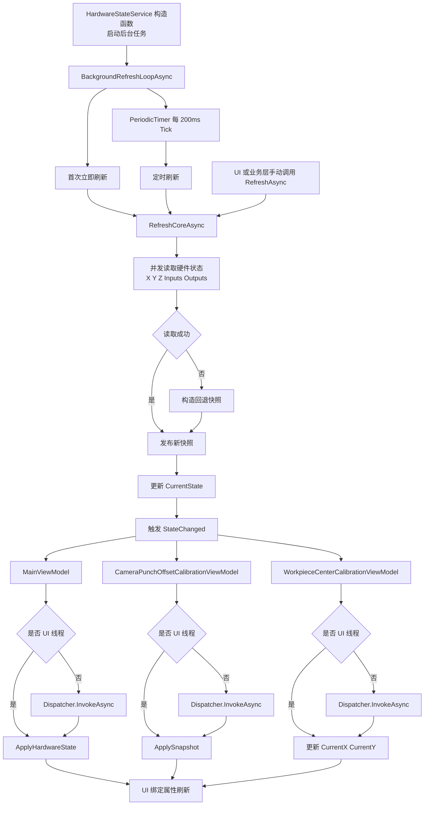

# HardwareStateService StateChanged 调用链说明

本文档记录 `IHardwareStateService.StateChanged` 在当前实现中的触发时机、线程关系，以及从后台服务到 UI 的完整调用链，便于后续排查 UI 刷新、线程切换和状态同步问题。

## 1. 结论

`StateChanged` 由 `HardwareStateService` 在发布硬件状态快照时触发，主要有两类来源：

1. 后台定时刷新触发。
2. UI 或业务层显式调用 `RefreshAsync` 后触发。

当前实现是“后台刷新 + 事件推送”模式，不是由 ViewModel 自己轮询硬件。

## 2. 关键代码位置

- 接口定义：[BLL/IHardwareStateService.cs](../BLL/IHardwareStateService.cs)
- 服务实现：[BLL/HardwareStateService.cs](../BLL/HardwareStateService.cs)
- 主界面订阅：[Fredy/ViewModels/MainViewModel.cs](../Fredy/ViewModels/MainViewModel.cs)
- 相机偏移校准订阅：[Fredy/Windows/CameraPunchOffsetCalibration/CameraPunchOffsetCalibrationViewModel.cs](../Fredy/Windows/CameraPunchOffsetCalibration/CameraPunchOffsetCalibrationViewModel.cs)
- 工件圆心校准订阅：[Fredy/Windows/WorkpieceCenterCalibration/WorkpieceCenterCalibrationViewModel.cs](../Fredy/Windows/WorkpieceCenterCalibration/WorkpieceCenterCalibrationViewModel.cs)

## 3. 触发时机

### 3.1 服务启动后自动后台刷新

`HardwareStateService` 构造时会立即启动一个后台任务：

- `Task.Run(BackgroundRefreshLoopAsync)` 启动后台循环。
- 后台循环先执行一次 `TryRefreshAsync`。
- 随后使用 `PeriodicTimer` 按 200ms 周期持续刷新。

这意味着服务一创建，`StateChanged` 很快就可能被触发一次，之后按约 200ms 的间隔继续触发。

### 3.2 外部显式调用 RefreshAsync

`IHardwareStateService` 暴露了 `RefreshAsync`。当 UI 或业务层在某些动作后主动调用它时，也会进入同一套刷新逻辑，并在成功或失败后发布快照，从而触发 `StateChanged`。

当前代码里，以下场景会主动调用：

- MainViewModel 初始化后主动刷新。
- CameraPunchOffsetCalibrationViewModel 初始化后主动刷新。
- WorkpieceCenterCalibrationViewModel 初始化后主动刷新。
- 运动、回零、IO 输出切换等操作执行完后主动刷新。

### 3.3 刷新失败也会触发

`TryRefreshAsync` 捕获异常后不会直接吞掉，而是基于当前缓存状态构造一个回退快照并发布。因此即使底层读取失败，`StateChanged` 也可能被触发，只是携带的是降级后的状态数据。

## 4. 调用链图

## 5. Inputs 和 Outputs 的完整刷新链路

`HardwareStateSnapshot` 中的 `Inputs` 和 `Outputs` 不是独立维护的缓存，而是每次刷新时和坐标信息一起构造成新的快照对象，再通过 `CurrentState` 和 `StateChanged` 对外发布。

### 5.1 后台定时刷新链路

后台刷新时，`Inputs` 和 `Outputs` 的完整链路如下：

1. `HardwareStateService` 构造完成后启动后台循环。
2. `BackgroundRefreshLoopAsync` 首次立即调用一次 `TryRefreshAsync`。
3. 后续 `PeriodicTimer` 每 200ms 再调用一次 `TryRefreshAsync`。
4. `TryRefreshAsync` 进入 `RefreshCoreAsync`。
5. `RefreshCoreAsync` 生成输入点和输出点端口号集合。
6. `RefreshCoreAsync` 并发调用 `_ioCard.ReadInputsAsync(...)` 读取输入状态。
7. `RefreshCoreAsync` 并发调用 `_ioCard.ReadOutputsAsync(...)` 读取输出状态。
8. `Task.WhenAll(...)` 等待坐标、输入、输出全部读取完成。
9. 使用 `inputsTask.Result` 和 `outputsTask.Result` 创建新的 `HardwareStateSnapshot`。
10. `PublishSnapshot(...)` 更新 `CurrentState`。
11. `PublishSnapshot(...)` 触发 `StateChanged`，订阅方据此更新 UI。

这意味着 `Inputs` 和 `Outputs` 默认都跟随后台 200ms 刷新节奏更新。

### 5.2 手动刷新链路

除了后台定时刷新，UI 或业务层显式调用 `RefreshAsync` 时，也会走同样的输入输出刷新路径：

1. 调用 `IHardwareStateService.RefreshAsync(...)`。
2. 直接进入 `RefreshCoreAsync(...)`。
3. 再次调用 `_ioCard.ReadInputsAsync(...)` 和 `_ioCard.ReadOutputsAsync(...)`。
4. 构造新的 `HardwareStateSnapshot`。
5. 更新 `CurrentState` 并触发 `StateChanged`。

所以 `Inputs` 和 `Outputs` 既会被后台定时刷新，也会在动作完成后被主动立即刷新一次。

### 5.3 刷新失败时的回退链路

如果 `TryRefreshAsync` 中任何一步抛出异常，当前实现不会停止事件推送，而是使用已有缓存回退：

1. `TryRefreshAsync` 捕获异常。
2. 记录告警日志。
3. 基于 `_currentState with { ... }` 构造回退快照。
4. `Inputs` 使用 `_currentState.Inputs`，如果原缓存为空则退回空字典。
5. `Outputs` 使用 `_currentState.Outputs`，如果原缓存为空则退回空字典。
6. 再次调用 `PublishSnapshot(...)`。

这表示在硬件读取失败时，界面看到的 `Inputs` 和 `Outputs` 不一定是最新值，但仍会收到一次状态推送，内容是“最近一次成功读取到的缓存值”或空字典。

### 5.4 UI 侧落点

`Inputs` 和 `Outputs` 最终会在订阅方中落到具体界面模型上：

1. 在 `CameraPunchOffsetCalibrationViewModel` 中，`ApplySnapshot(...)` 遍历 `GpioIn`，把 `state.Inputs` 映射到输入点显示状态。
2. 在同一个 `ApplySnapshot(...)` 中，遍历 `GpioOut`，把 `state.Outputs` 映射到输出点显示状态。
3. 事件如果来自后台线程，则先通过 `Dispatcher.InvokeAsync(...)` 切回 UI 线程，再更新这些绑定对象。

因此对界面来说，GPIO 显示并不是自己去读板卡，而是依赖 `HardwareStateSnapshot.Inputs` 和 `HardwareStateSnapshot.Outputs` 这两个快照字段持续推送。

### 5.5 当前行为特征

当前实现有两个值得注意的行为：

1. 即使 `Inputs` 和 `Outputs` 与上一次完全相同，只要刷新流程执行完成，仍会发布新快照并触发一次 `StateChanged`。
2. `Inputs` 和 `Outputs` 与 XYZ 坐标共用同一次刷新事务和同一个事件出口，不是分开推送的。

## 6. 线程模型

### 5.1 事件通常在后台线程触发

后台循环由 `Task.Run` 启动，内部又使用 `ConfigureAwait(false)` 执行刷新逻辑，因此 `PublishSnapshot` 和 `StateChanged?.Invoke(...)` 通常发生在后台线程，而不是 WPF UI 线程。

### 5.2 UI 订阅方自行切回 Dispatcher

当前几个主要订阅方都假设事件回调可能发生在非 UI 线程，因此处理方式基本一致：

1. 先检查 `Application.Current?.Dispatcher`。
2. 如果已经在 UI 线程，直接更新 ViewModel 状态。
3. 如果不在 UI 线程，通过 `Dispatcher.InvokeAsync(...)` 切回 UI 线程后再更新绑定属性。

这也是当前实现能安全更新 WPF 绑定对象的关键。

## 7. 当前设计的意义

这种实现符合项目中“硬件状态后台刷新，UI/业务层订阅变化”的方向，优点是：

1. ViewModel 不需要直接轮询硬件。
2. UI 层只处理展示和线程切换，职责更清晰。
3. 后续如果需要增加新的界面或业务订阅方，只要订阅 `StateChanged` 即可复用同一份硬件状态流。

## 8. 使用和排查建议

如果后续遇到“界面位置不刷新”或“GPIO 状态延迟”的问题，可以优先按下面顺序排查：

1. `HardwareStateService` 是否已成功构造并启动后台循环。
2. `RefreshCoreAsync` 是否能正常读到运动轴和 IO 状态。
3. `PublishSnapshot` 是否被执行。
4. 订阅方是否已注册 `StateChanged`。
5. 订阅回调里是否正确切回 Dispatcher 更新 UI。

如果排查的是 GPIO 显示异常，可以进一步确认：

1. `_ioCard.ReadInputsAsync(...)` 和 `_ioCard.ReadOutputsAsync(...)` 是否返回了正确端口值。
2. `HardwareStateSnapshot.Inputs` 和 `HardwareStateSnapshot.Outputs` 是否在快照构造时正确写入。
3. UI 中 `GpioIn` 和 `GpioOut` 的映射逻辑是否与端口编号一致。

如果后续需要进一步降低 UI 更新频率，可以在 `PublishSnapshot` 前增加“快照是否真的变化”的比较逻辑，避免每个周期都向 UI 推送完全相同的数据。