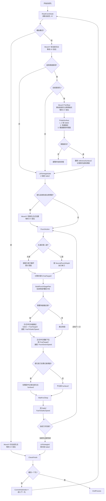
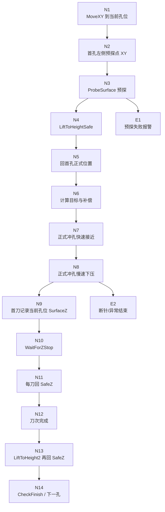

# 冲孔状态机移动逻辑图

## 1. 审计范围

本文只整理 `PunchStateMachine` 中与“移动”直接相关的当前实现，重点覆盖：

- 每孔开始前的 XY 走位。
- 首孔左侧预探的 XY/Z 移动。
- 正式冲孔的两段式 Z 下压。
- 每刀结束后的 SafeZ 回退。

对应主要代码：

- `BLL/AutoPunchMachine.cs`
- `BLL/Hardware/Adt8940Controller.cs`

## 2. 当前实现结论

### 2.1 XY 走位

当前 `MoveXY` 与 `MoveXYToOffset` 已改为：

- X/Y 两轴并发启动。
- 等待两轴都到位后才返回。

因此状态机在继续进入“预探”或“正式冲孔”前，XY 已经落位。

### 2.2 首孔左侧预探

只有首孔且启用探测时，才会进入左侧预探流程：

1. 先移动到当前孔位 XY。
2. 再移动到首孔左侧偏移点 XY。
3. Z 绝对移动到 `SafeZ`。
4. Z 按“快速接近距离/速度”下探。
5. Z 再按“慢速搜索距离/速度”下探并探面。
6. 探到表面后，记录首个基准 `SurfaceZ`。
7. Z 抬回 `SafeZ`。
8. XY 再回到首孔正式孔位。

### 2.3 正式冲孔

当前正式冲孔已改成两段式：

1. 以 `SafeZ` 为当前刀次的起点。
2. 先执行“快速接近段”。
   - 速度使用 `FastToSafeZSpeed`。
   - 快段目标不会越过最终冲孔目标。
   - 若最终目标本身已经很浅，会自动跳过快段。
3. 再执行“慢速冲孔段”。
   - 速度使用 `PunchDownSpeed`。
   - 首个正式孔首刀如果需要记录当前孔位表面 Z，只在这一段中记录。
4. 等待 Z 轴停止。
5. Z 快速回到 `SafeZ`。

### 2.4 当前仍存在的实现特征

当前状态机里，每刀正式冲孔完成后已经在 `ExecutePunchAction(...)` 内回了一次 `SafeZ`，随后状态机会继续进入 `LiftToHeight2` 再回一次 `SafeZ`。

这表示：

- “每刀后回 SafeZ”是成立的。
- 但当前实现里存在一次重复回 SafeZ 的冗余动作。

## 3. Mermaid 图

## 4. 图的阅读说明

### 4.1 首孔与非首孔的区别

- 只有首孔会走左侧预探点。
- 非首孔直接跳过预探，进入 `LiftToHeightSafe` 和正式冲孔。

### 4.2 每刀正式冲孔的起点

当前代码语义下，每刀正式冲孔都以 `SafeZ` 为起点：

- 上一刀结束后已回 `SafeZ`。
- 下一刀开始时快段计划也是以 `SafeZ` 为基准计算。

### 4.3 快段与慢段的用途

- 快段：只负责从 `SafeZ` 快速靠近最终目标上方。
- 慢段：负责真正完成到 `FinalTargetZ` 的冲孔，并承担首孔首刀的表面样本记录。

### 4.4 当前建议继续关注的点

若后续继续收敛流程，优先建议处理：

1. 去掉 `LiftToHeight2` 的重复回 SafeZ。
2. 结合现场日志，再次确认 Z 轴“到位/停稳”判定与实际位置反馈是否一致。

## 5. 日志关键字对照图

下面这张图不再强调完整控制流，而是强调“Mermaid 节点编号”和“日志关键字”的对应关系，便于按日志反查流程走到了哪一步。

### 5.1 节点与日志文案一一对应

| 节点 | 流程含义 | 典型日志关键字 | 备注 |
| --- | --- | --- | --- |
| `N1` | 移动到当前孔位 | `移动到该孔...` | 对应 `Hardware.MoveXY(...)` 之前的状态机日志 |
| `N2` | 移动到首孔左侧预探点 | `首孔左侧预探：先移动到左侧测试点` | 只有首孔且启用探测才会出现 |
| `N3` | 首孔左侧预探 | `首孔左侧预探：先移动到 SafeZ=` | 同一阶段会带出 `FastDistance`、`SlowDistance`、`Mode` |
| `N3` | 首孔左侧预探成功 | `首孔左侧预探成功，基准表面Z=` | 预探成功后更新基准面 |
| `E1` | 首孔左侧预探失败 | `首孔左侧预探未检测到工件表面` | 这是报警并结束流程的直接信号 |
| `N4` | Z 抬到安全高度 | `Z轴抬起到安全高度...` | 来自 `LiftToHeightSafe` |
| `N5` | 首孔预探后回正式孔位 | `首孔探测完成，回到首孔目标位置准备冲孔...` | 仅首孔预探成功后出现 |
| `N6` | 开始本刀正式冲孔 | `执行头道第` 或 `执行二道冲孔` | 这类日志会带累计深度、补偿、目标Z |
| `N7` | 正式冲孔快速接近 | `正式冲孔快速接近:` | 会带 `SafeZ`、`FastTargetZ`、`Distance`、`Speed` |
| `N7` | 跳过快速接近 | `正式冲孔跳过快速接近` | 目标较浅时直接进入慢段 |
| `N8` | 正式冲孔慢速下压 | `正式冲孔慢速下压:` | 会带 `FinalTargetZ`、`Distance`、`PunchDownSpeed` |
| `N8` | 硬件层实际下压 | `执行冲孔下压:` | 来自硬件层，能看到 `CurrentZ`、`TargetZ`、`DetectSurface` |
| `N9` | 首个正式孔首刀未记录到表面 | `第一个正式孔首刀冲孔过程中未检测到Surface Z` | 继续沿用左侧预探点 Z |
| `N9` | 首个正式孔首刀记录到表面 | `第一个正式孔首刀已记录当前点Surface Z=` | 后续孔位开始用最近邻样本补偿 |
| `N10` | 等待 Z 轴停止 | `等待Z轴运动结束...` | 每刀正式冲孔后都会出现 |
| `N11` | 每刀回 SafeZ | `本次冲孔结束，Z轴回到全局安全位 SafeZ=` | 对应 `ExecutePunchAction(...)` 内的回退 |
| `N12` | 刀次完成 | `头道第` + `次冲孔完成。` 或 `二道冲孔完成。` | 头道和二道文案不同 |
| `N13` | 当前孔完成后的再次回 SafeZ | `冲孔结束，Z轴抬起...` | 这是当前实现里额外的第二次回 SafeZ |
| `N14` | 全部孔结束 | `所有孔位加工完毕！` | 最后一个孔完成后出现 |
| `N14` | 流程收尾 | `冲孔流程已结束/就绪。` | `EndProcess()` 收尾日志 |
| `E2` | 断针异常 | `检测到断针！停止Z轴！` | 后面通常还会跟 `断针报警！请检查冲针。` |

### 5.2 推荐的日志检索顺序

如果你在现场按日志回放一次完整冲孔，建议优先按下面顺序搜关键词：

1. `移动到该孔...`
2. `首孔左侧预探：先移动到左侧测试点`
3. `首孔左侧预探：先移动到 SafeZ=`
4. `首孔左侧预探成功，基准表面Z=`
5. `正式冲孔快速接近:` 或 `正式冲孔跳过快速接近`
6. `正式冲孔慢速下压:`
7. `执行冲孔下压:`
8. `等待Z轴运动结束...`
9. `本次冲孔结束，Z轴回到全局安全位 SafeZ=`
10. `头道第` / `二道冲孔完成。`

如果日志在第 5 步之前中断，通常是 XY 走位或首孔预探问题；如果停在第 6 到第 8 步之间，更值得优先排查 Z 轴执行与停稳判定。